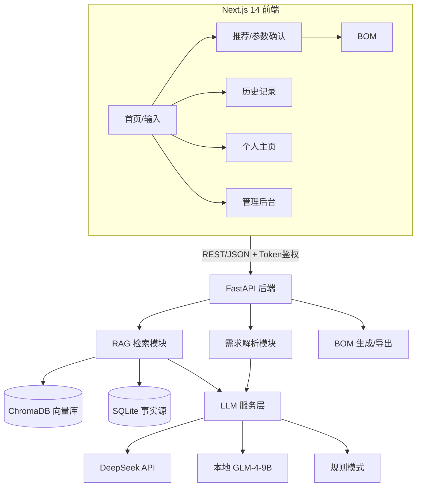

# AI 硬件选型助手 · 完整技术方案

> 状态：MVP 已实现并本地部署。本文档汇总系统全部技术设计，是开发与面试的权威参考。

---

## 一、系统架构总览



## 二、技术栈与选型

| 层 | 技术 | 选型理由 |
|----|------|---------|
| 前端 | Next.js 14（App Router）+ React + TypeScript + TailwindCSS | SSR、组件化、类型安全、移动端适配 |
| 后端 | Python 3.12 + FastAPI + Pydantic | AI 生态、自动 Swagger、数据校验 |
| AI | DeepSeek / 本地 GLM-4-9B / 规则模式（三档可切换） | 质量-成本-可用性权衡 |
| 嵌入模型 | sentence-transformers paraphrase-multilingual-MiniLM-L12-v2 | 384 维、中文、CPU 可跑 |
| 向量库 | ChromaDB（HNSW 索引） | 轻量、本地、语义近邻检索 |
| 关系库 | SQLite | 零配置、事实源、事务安全 |
| 导出 | openpyxl（Excel）/ csv | BOM 交付 |

## 三、数据层设计

### 3.1 双库分工

- **ChromaDB = 语义索引**：存元器件描述向量 + 元数据（品类/厂商/价格），回答"谁和我最像"
- **SQLite = 事实源（Source of Truth）**：存结构化字段（型号/电压/接口/价格/Datasheet），展示数据一律以它为准

### 3.2 SQLite 表结构

| 表 | 作用 |
|----|------|
| components | 元器件主表（含电压范围/价格/Datasheet/params_json/tags） |
| component_params | 元器件扩展参数 |
| bom_records / bom_items | BOM 记录与明细 |
| history_records | 历史记录（紧凑存储：标题/需求截断/参数/紧凑推荐） |
| app_settings | 应用设置（LLM 供应商/模型/BaseURL/Key） |
| analytics_events | 埋点事件 |

### 3.3 数据源与导入

- 源数据：`data/components_*.json`（按品类拆分，便于维护）
- 导入：`build_kb.py` 合并去重 → 校验必填字段 → 写入 SQLite → 描述文本嵌入 → upsert 到 ChromaDB
- 管理：后台 `/admin` 支持增删改查 + 一键重建索引

## 四、RAG 检索流程（核心）

### 4.1 两阶段

**离线索引（建库）**：
```
JSON → 清洗校验 → SQLite 结构化字段 + 描述文本 → 嵌入模型(384维) → ChromaDB
```

**在线检索生成**：
```
用户需求 → LLM 解析为结构化参数 → 用户确认
  → 向量检索(ChromaDB Top30) + 关键词检索(Top30) 双路合并
  → 结构化过滤（电压≤5.5V 才硬过滤 / 特定接口 I2C/SPI/UART/CAN）
  → 品类均衡压缩（每类≤3、共≤15，适配本地模型 4096 上下文）
  → LLM 从候选排序 + 写理由（禁止编型号）
  → SQLite 交叉验证（查不到即丢弃）→ Top5
```

### 4.2 为什么双路检索

- 向量检索懂语义但可能品类失衡（实测：小车查询 Top30 中 18 个电源芯片）
- 关键词检索保证字面覆盖；双路合并取并集保品类

### 4.3 防幻觉三层

| 层 | 机制 |
|----|------|
| 候选约束 | Prompt 锁定"只能从候选列表选择，不能编造型号" |
| 型号验证 | LLM 输出 part_number 回 SQLite 查，查不到丢弃 |
| 数据为准 | 价格/参数/Datasheet 全部来自数据库，LLM 只写理由与评分 |

## 五、LLM 服务设计

### 5.1 供应商抽象

| 供应商 | 实现 | 适用 |
|--------|------|------|
| deepseek | OpenAI 兼容接口（api.deepseek.com） | 高质量云端 |
| local | 子进程调用 Ollama（GLM-4-9B） | 零成本本地 |
| openai / claude / custom | OpenAI 兼容 / Anthropic 接口 | 备用 |
| mock | 规则解析 + 关键词打分 | 兜底/离线 |

### 5.2 关键实现细节

- **配置动态化**：DB 设置优先、环境变量兜底，个人主页改配置即时生效（无需重启）
- **本地模型经子进程调用**：规避长驻进程 Windows 管道编码问题；stdin/stdout 显式 UTF-8 字节流
- **Qwen3 关闭思考模式**：`think:false` + `keep_alive`；GLM-4-9B 无思考模式问题
- **降级链**：LLM 失败 → 规则模式 → 响应带 `degraded` 标识 → 前端提示
- **候选压缩**：排序输入按品类均衡取 15 个、描述截断，控制在 4096 上下文内

### 5.3 两次调用

1. `/parse`：文本 → 结构化参数 JSON（Pydantic 校验）
2. `/recommend`：参数+候选 → JSON 数组（id/part_number/reason/score）

## 六、API 设计

### 6.1 业务接口

| 方法 | 路径 | 功能 |
|------|------|------|
| POST | /api/v1/parse | 需求解析（含 degraded 标识） |
| POST | /api/v1/recommend | RAG 推荐（含 degraded 标识） |
| POST | /api/v1/bom/generate | 生成 BOM |
| GET | /api/v1/bom/{id}/export?format=excel\|csv | 导出（支持数量覆盖） |
| GET | /api/v1/components/{id} | 元器件详情 |
| GET | /api/v1/components/search | 搜索 |

### 6.2 支撑接口

| 方法 | 路径 | 功能 |
|------|------|------|
| GET/POST/PUT/DELETE | /api/v1/history | 历史记录（纯 DB，零 token） |
| GET/PUT/POST | /api/v1/settings/llm(+ /test) | LLM 配置与连通性测试 |
| POST/GET | /api/v1/analytics/event、/summary | 埋点上报与看板 |
| GET/POST/PUT/DELETE | /api/v1/admin/components、/kb/rebuild | 元器件管理与索引重建 |
| GET | /health | 健康检查 |

## 七、安全设计

| 机制 | 实现 |
|------|------|
| 接口鉴权 | 所有 /api/v1/* 需 `X-API-Token`（FastAPI 依赖注入） |
| 速率限制 | LLM 接口 10 次/分/IP，其余 120 次/分（内存版，生产换 Redis） |
| Key 安全 | backend/.env 与 frontend/.env.local 均 gitignored |
| 降级 | LLM 失败自动回退规则，degraded 标识透传前端 |
| 免责 | 页脚数据来源/价格免责/隐私说明 |
| 输入限制 | 前端 500 字上限 |

## 八、前端架构

### 8.1 页面（7 个）

| 页面 | 路径 | 要点 |
|------|------|------|
| 首页 | / | 输入+示例+可选参数+信任页脚 |
| 推荐 | /recommend | 参数确认+筛选排序+推荐卡+一键全选 |
| BOM | /bom | 表格+数量编辑+导出+AI 概要 |
| 详情 | /component/[id] | 参数/Datasheet/采购 |
| 历史 | /history | 列表/详情/删除/清空 |
| 个人主页 | /profile | LLM 供应商配置+测试 |
| 管理后台 | /admin | 元器件管理+数据看板 |

### 8.2 关键设计

- 状态传递：sessionStorage（参数/推荐/BOM/已选/query/degraded）
- 埋点：`PageViewTracker`（layout 级）+ 各页面行为事件
- 鉴权：`lib/api.ts` 统一携带 X-API-Token
- 设计系统：Tailwind 令牌（brand/ink 色板、动画、组件类）

## 九、运营与数据

- **埋点**：10+ 事件（页面访问/解析/推荐/点击/选择/生成/导出/设置）
- **看板**：总事件/今日/核心漏斗/最近事件（/admin）
- **日志**：中间件记录 方法/路径/状态/耗时
- **备份**：backup_db.py（SQLite + 向量库）
- **反馈**：页脚邮件入口 + 缺失元器件提交

## 十、质量保障

| 手段 | 说明 |
|------|------|
| 冒烟测试 | smoke_test.py：全链路（解析→推荐→BOM→导出→搜索→详情） |
| 质量对比 | local_model_quality_test.py：6 场景，本地 vs 云端 |
| 评估集 | eval_20_scenarios.py：20 个课程设计/电赛/毕设场景 |
| 可靠性 | ollama_reliability_test.py：本地模型连续调用稳定性 |

## 十一、部署方案

- **本地**：start_backend.bat（uvicorn）+ npm run dev；Ollama 模型目录 D:\OllamaModels
- **云端**：Vercel（前端）+ Render（后端 Docker，见 DEPLOYMENT.md）
- 上线前置：账号体系替换 Token、Redis 限流、HTTPS

## 十二、未来演进

| 方向 | 说明 |
|------|------|
| 数据管道 | 商城开放接口批量获取 + 价格同步 + 审核流程 |
| AI 补充元器件 | 库外候选必须附来源链接（分层可信），V2 接联网检索 |
| 规模化 | 百万级向量（Milvus/Qdrant）、水平扩展 |
| 商业化 | 立创 CPS 采购返佣、B2B2C 教育机构 |
| 产品化 | 登录/方案保存（P1）、元件对比/替代料（P2） |
